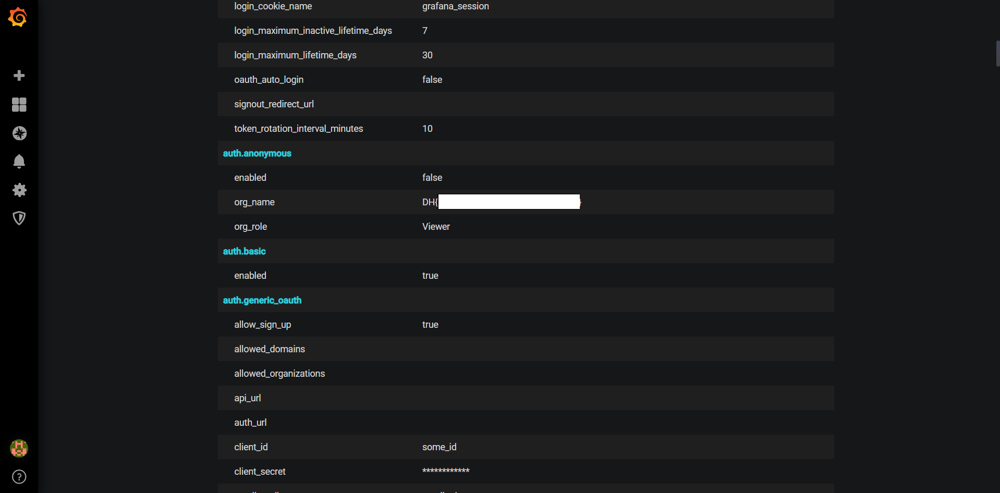

# [web-misconf-1](https://dreamhack.io/wargame/challenges/45)

풀이
---------------------------------------
 문제 파일을 다운 받은 후 deploy/defaults.ini파일이 있습니다. 파일에서 admin_id 와 admin_pw를 찾은후 로그인을 하면 admin 계정으로 로그인이 되며, 그 후 설정창으로 가면 org_name에 FLAG가 있습니다.

FLAG
---------------------------------------
